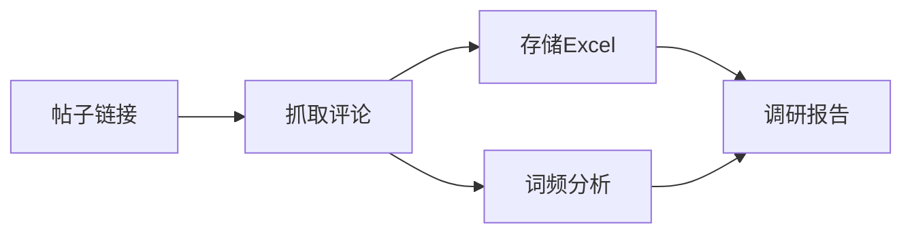

# 小红书评论痛点挖掘器

从小红书帖子评论中系统性挖掘用户痛点，支持数据采集、存储、分析和报告生成。

## 工作流程



### Step 1: 评论抓取

使用浏览器辅助模式抓取评论（需用户先在浏览器登录小红书）：

```bash
python scripts/extract_comments.py "<帖子链接>" --output comments.json
```

**输出字段**：
- 评论内容、点赞数、发布时间
- 用户昵称、是否作者回复
- 子评论（二级评论）

### Step 2: 数据存储

将评论数据保存到 Excel：

```bash
python scripts/save_to_excel.py comments.json --output 评论数据.xlsx
```

### Step 3: 词频与情感分析

分析高频词和情感倾向：

```bash
python scripts/analyze_keywords.py comments.json --output 分析结果.xlsx
```

**分析内容**：
- 高频词 TOP50
- 情感分布（正面/负面/中性）
- 痛点关键词提取
- 词云图生成

### Step 4: 生成报告

基于 `references/report_template.md` 模板生成调研报告，包含：

1. **核心洞察摘要** - 一句话总结
2. **用户痛点分析** - 分类整理 + 原文引用
3. **高频词分析** - TOP10 关键词解读
4. **情感分布** - 可视化图表
5. **需求机会点** - 基于痛点的改进建议
6. **原始数据附录** - 高赞评论 TOP20

## 输出产物

| 文件 | 格式 | 用途 |
|------|------|------|
| 评论数据.xlsx | Excel | 完整评论，支持筛选 |
| 分析结果.xlsx | Excel | 词频统计、情感分析 |
| 调研报告.md | Markdown | 可读性报告 |
| 词云图.png | 图片 | 可视化展示 |

## 依赖安装

```bash
pip install playwright openpyxl jieba pandas wordcloud snownlp matplotlib
playwright install chromium
```

## 注意事项

> [!WARNING]
> 需要先在浏览器中登录小红书账号，技能才能正常抓取评论。

> [!NOTE]
> 抓取的数据仅供个人研究使用，请遵守小红书用户协议。
